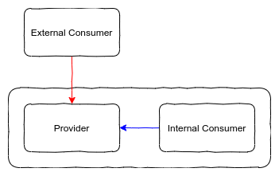
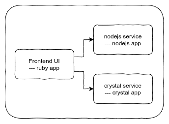
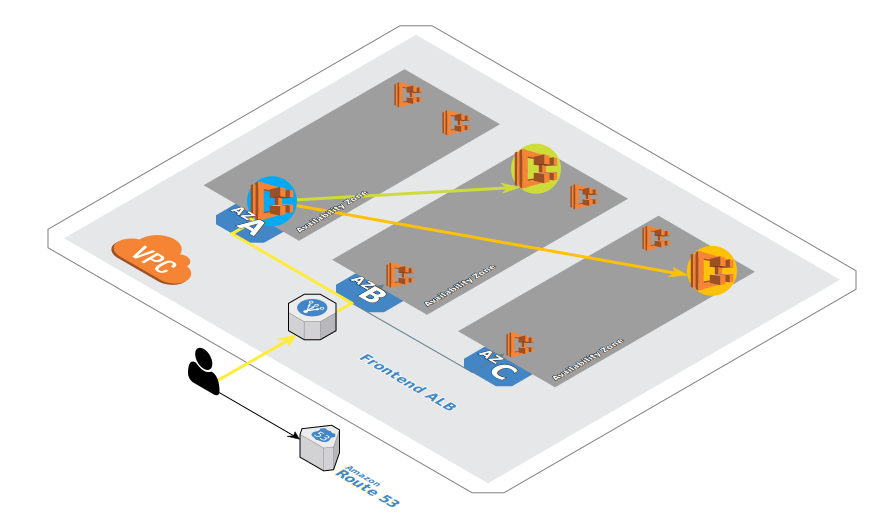
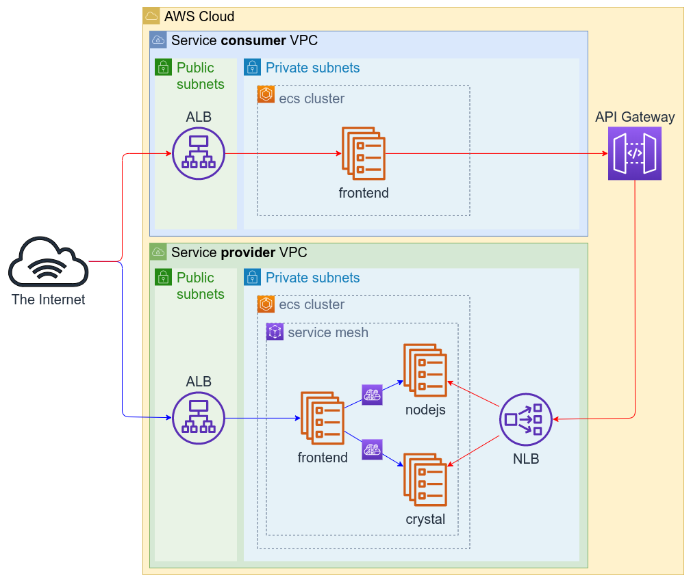
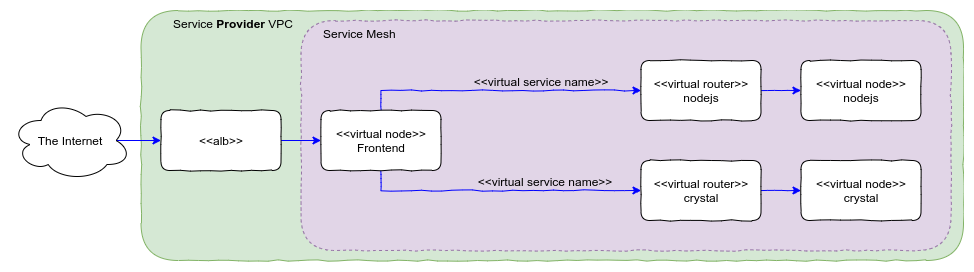
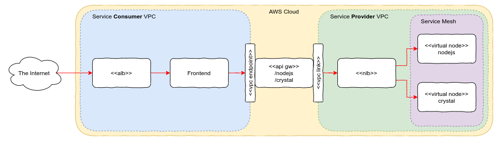
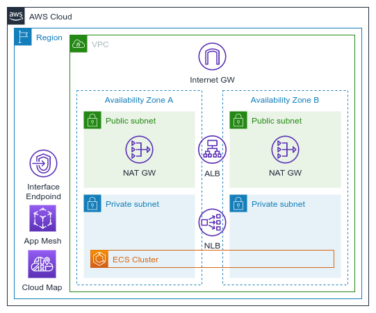

# Service Mesh deployment demo

This project aims to demonstrate how to deploy a microservices architecture on AWS ECS, leveraging on AWS App Mesh for East/West integration between those services and on AWS API Gateway for North/South integration. 

Before diving into that, let's recap the concepts mentioned above:  

 

Whenever you define a boundary (it could be a Datacenter, a Service Mesh, or even a Subnet), East/West is the communication that happens within that boundary, like the blue arrow in the diagram above, and North/South is the inbound communication to that boundary, like the red arrow. 

This project uses a simple application, composed by a Frontend Web UI written in [ruby](https://www.ruby-lang.org/en/) and two different backend services, one written in [nodejs](https://nodejs.org/en/) and another one written in [crystal](https://crystal-lang.org). 

 

Each backend services returns a 'Hello World' message, informing its IP address and Availability Zone within AWS Cloud. The frontend UI makes repetitive and infinite requests to those backend services, writing down their responses and plotting on a map the path each request took:

 

On the diagram above, the request arrived at the frontend UI on the availability zone A, and then a request was made to the nodejs backend on the zone B, and to the crystal backend on the zone C. 

Their source code can be obtained here: 
- [nodejs](https://github.com/brentley/ecsdemo-nodejs)
- [crystal](https://github.com/brentley/ecsdemo-crystal)
- [frontend](https://github.com/brentley/ecsdemo-frontend)

The architecture of this deployment uses the following AWS Services:

1. [AWS CloudFormation](https://docs.aws.amazon.com/AWSCloudFormation/latest/UserGuide/GettingStarted.html) : Used to deploy this whole architecture using the '*infrastructure as code*' paradigm.
1. [Amazon VPC](https://docs.aws.amazon.com/vpc/latest/userguide/vpc-getting-started.html) : Used to define an isolated and secure network perimeter for the application. 
1. [Amazon ECS](https://docs.aws.amazon.com/AmazonECS/latest/developerguide/getting-started-ecs-ec2.html) : All the components of this application were encapsulated into containers. ECS is a container orchestration that aims to provide scalability and resiliency to a container-based architecture. 
1. [Application Load Balancer](https://docs.aws.amazon.com/elasticloadbalancing/latest/application/application-load-balancer-getting-started.html) : In order to provide internet-facing, easy access, to the frontend UI, an application load balancer was added to the solution.
1. [Network Load Balancer](https://docs.aws.amazon.com/elasticloadbalancing/latest/network/network-load-balancer-getting-started.html) : Used by API Gateway as its entry point into the VPC, and also load balancing the requests among the difference instances of each backend service. 
1. [AWS Cloud Map](https://docs.aws.amazon.com/cloud-map/latest/dg/setting-up-cloud-map.html) : Provides *service discovery* capabilities to the application. Since all these components were deployed using an auto-scaling topology using ephemeral containers, it is important to have a mechanism to allow each service to discover the location of other services. 
1. [AWS App Mesh](https://docs.aws.amazon.com/app-mesh/latest/userguide/appmesh-getting-started.html) : Creates a service mesh, allowing the microservices to talk to each other in a secure, reliable and scalable way, providing East/West integration capabilities within the application.
1. [Amazon API Gateway](https://docs.aws.amazon.com/apigateway/latest/developerguide/getting-started.html) : Encapsulates access to the backend services, adding a layer of control to the application, that way allowing North/South integration capabilities to the application.

> **DISCLAIMER**: This not a production ready system. It is meant only to educate in terms of what can be achieved with the components aforementioned. In order to understand AWS best practices to production topologies, please refer to [AWS Well Architected Framework](https://aws.amazon.com/architecture/well-architected/)

## Topology

As mentioned earlier, this application will be deployed onto a ECS cluster, using a service mesh to encapsulate it. In the next diagram, notice that there are 2 different paths used to reach the backend services, colored with different colors.

The blue path illustrates the East/West scenario: The frontend UI is part of the service mesh, and it communicates with the backend services directly within the mesh, relying on the Cloud Map service discovery to figure out the ip address where those services are running. 

The red path illustrates the North/South scenario. The fronted UI is deployed onto a separated VPC on the same AWS account, but it could be running on another AWS account or even on-premises. 

You can reach the frontend app of these scenarios by accessing its related application load balancer URL on your web browser.

## Communication

There are a few concepts hidden on the previous diagram that needs to be explored on each scenario.

### Blue scenario:

- When the request arrives at the service mesh from the ALB, it reaches the ***Virtual Node*** endpoint declared for the frontend UI. A ***Virtual Node*** is an abstraction of a deployment or physical server where your service/application is running. In this case, we are only using one ***Virtual Node*** per service. It represents its deployment on ECS.  

- When the frontend UI makes a request to a backend service, it uses its ***Virtual Service*** name. Since containers are ephemeral, the only way that the frontend service can figure out where the backend service is running, is by relying on a 'Service Discovery' component.    
&nbsp;  
Every time a new task is started at the ECS cluster, the ECS service registers this task on AWS Cloud Map, and a DNS entry is created on Route 53 for this task. The ***Virtual Service*** is this name being used to register the task.

- Instead of reaching directly the ***Virtual Node*** (can be done), the frontend UI is talking to the ***Virtual Router*** component. This router has the ability to abstract the connectivity to several distinct ***Virtual Nodes***, adding intelligence to the routing logic. For instance, if you want to setup a blue/green deployment of one of the backend services, you could add the routing rules on this component.  

### Red Scenario

 

- Despite the fact that API Gateway is a public AWS service, it has the ability to host private APIs exposed only to authorized VPCs, through the use of ***Interface Endpoints*** deployed onto those VPCs. This setup enables private communication between the service consumer and the API itself.

- For accessing private services on a AWS Account without having the need to expose them on the internet, API Gateway has the ability to leverage a ***VPC Link*** integration. This setup allows a private communication between the API and its backend services. 

- You can see that the backend services (nodejs, crystal) are the same ones being accessed in the previous scenario. This setup demonstrates that a service lying on a mesh can be exposed to consumers outside of it as well.

## CloudFormation Stacks

For simplicity sake, this project was split into 4 reusable Cloud Formation templates, each one being responsible for deploying part of the architecture.

1. **base.yaml**  
&nbsp;  
  
&nbsp;  
Deployed twice, creates the base stack for the **Service Provider (South)** and **Service Consumer (North)**  :
	-	VPC and its related components
	-	ECS cluster its related components
	-	**Application** Load Balancer
	- **Network** Load Balancer onto the **provider** VPC
	-	App Mesh instance on the provider VPC onto the **provider** VPC
	- Cloud Map instance on the provider VPC onto the **provider** VPC
	- API Gateway's VPC Link onto the **provider** VPC
	- API Gateway's Endpoint Interface onto the **consumer** VPC  
2. **service.yaml**  
&nbsp;  
Deployed 4 times, deploy an application onto the respective ECS cluster and its following related components:
	- ECS Task Definition 
	-	ECS Service
	-	Load Balancer listener 
	-	Load Balancer Target Group
	-	App Mesh Virtual Service onto the **provider** stack
	-	App Mesh Virtual Node onto the **provider** stack
	-	App Mesh Virtual Router and route onto the **provider** stack
	-	Cloud Map service discovery entry onto the **provider** stack
	-	CloudWatch log group

3.	**north.yaml**  
&nbsp;  
This template is used to instantiate the resources needed for the red scenario. It deploys the frontend UI as a Task Definition onto the **consumer** ECS Cluster and the same components related to it described on the previous template. In addition to that it deploys the following API Gateway components:
	- Private REST API 
	-	Resource and Method for the nodejs backend
	-	Resource and Method for the crystal backend
	-	Stage
	- Deployment

### Getting Started

Click [here](https://console.aws.amazon.com/cloudformation/designer/home?&templateURL=https://servicemesh-demo-templates.s3-sa-east-1.amazonaws.com/stack.yaml){:target="_blank" rel="noopener"} to deploy this stack on your AWS Account.

In order to deploy this topology on your AWS account, clone this repository and deploy each template in the order mentioned above. Remember that you need to deploy the service stack 3 times (one for each application). If you need detailed instructions, follow [this](./) guide.